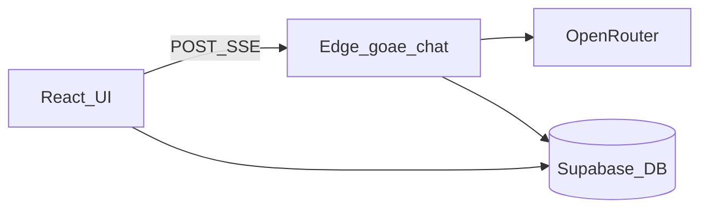

# DocBill – Architektur

Überblick über Komponenten, Datenfluss und Konfiguration. Detailierte Abläufe: [PIPELINE.md](./PIPELINE.md). API-Vertrag: [API-goae-chat.md](./API-goae-chat.md).

## Komponenten

| Schicht | Technologie | Rolle |
|--------|-------------|--------|
| Web-App | React, TypeScript, Vite, Tailwind, shadcn/ui | UI, Chat, Einstellungen, Aufruf der Edge Function |
| Backend | Supabase (Auth, Postgres, Row Level Security) | Nutzerdaten, Konversationen, Nachrichten, Hintergrundjobs |
| Serverlogik | Supabase Edge Function `goae-chat` (Deno) | Intent-Routing, Rechnungs-/Service-Pipelines, Chat ohne Upload |
| KI-Gateway | OpenRouter (Secret `OPENROUTER_API_KEY` in Supabase) | LLM-Aufrufe aus der Edge Function |

Die App lädt GOÄ-Kontext (Katalogauszüge, Paragraphen, Regeln) **in der Edge Function** ein und kombiniert das mit optionalen Admin-Dateien und Nutzer-`extra_rules`.

## Datenfluss (Happy Path)

1. Nutzer sendet Nachricht (optional mit Dateien). Das Frontend baut `messages`, `files`, `model`, `engine_type`, `extra_rules` und optional `last_invoice_result` / `last_service_result`.
2. [`executeGoaeChatRequest`](../src/lib/executeGoaeChatRequest.ts) sendet `POST` an `goae-chat` mit Supabase-`Authorization`-Header (anonym oder Session, wie im Client verwendet).
3. Die Antwort ist ein **SSE-Stream** (`text/event-stream`). Er enthält Fortschritts-Events, optional strukturierte Ergebnisse und OpenRouter-kompatible `choices[].delta.content`-Chunks für Fließtext.
4. [`consumeGoaeChatSseStream`](../src/lib/goaeChatSse.ts) parst die Events; UI aktualisiert Progress, `InvoiceResult`/`ServiceBillingResult` und Markdown-Chat.
5. Persistenz: Konversationen und Nachrichten in Supabase; strukturierte Assistentenantworten auch in `messages.structured_content` (siehe [DATA_MODEL.md](./DATA_MODEL.md)).

## Engine-Typ und Einstellungen

- **`engine_type`** steuert den **Rechnungs-Upload-Pfad** (wenn Dateien vorliegen und der Workflow nicht „Leistungen abrechnen“ ist) bzw. **Engine 3** für beide Haupt-Workflows:
  - `simple`: zweistufige Pipeline (Dokumentparser + ein großer LLM-Aufruf mit Streaming), **ohne** strukturiertes `pipeline_result`.
  - `engine3`: eigenständige Pipeline mit **`engine3_result`** (siehe [PIPELINE.md](./PIPELINE.md)).
  - sonst (Standard): sechsstufige Pipeline mit Regelengine und **`pipeline_result`** vor der Erklärung.
- Werte kommen aus `user_settings.engine_type` mit Fallback auf `global_settings.default_engine` (siehe Types in [`types.ts`](../src/integrations/supabase/types.ts)).

## Admin-Kontext und Regeln

- **`extra_rules`**: Kombination aus globalen Standardregeln und nutzerspezifischen Regeln (vom Client gebildet).
- **RAG-ähnlicher Admin-Kontext**: Die Function lädt relevante Ausschnitte aus hochgeladenen Admin-Textdateien (`loadRelevantAdminContext` nach Query aus Nutzerfrage bzw. Pipeline-Zwischenstand).
- Globale/persönliche Regeln werden im Chat-Systemprompt bzw. in Pipeline-Prompts eingebunden.

## GOÄ- und KI-Kontext: Quellen und Garantien

DocBill trennt drei Ebenen; das ist relevant für Erwartungen an „richtige“ GOÄ-Antworten:

| Ebene | Inhalt | Typische Quelle im Code |
|--------|--------|------------------------|
| **Deterministisch** | Ziffern, Punkte, Schwellen-/Höchstfaktoren, Ausschlussmatrix (inkl. dokumentierter Patches z. B. Beratung 1–3, Tonometrie 1255–1257) | [`goae-catalog-full.json`](../supabase/functions/goae-chat/goae-catalog-full.json) → [`buildRegelKatalogMapFromJson`](../supabase/functions/goae-chat/goae-catalog-json.ts); Engine-3-Nachlauf z. B. [`applyEngine3AusschlussPass`](../supabase/functions/goae-chat/pipeline/engine3/validate.ts); Regelengine [`regelengine.ts`](../supabase/functions/goae-chat/pipeline/regelengine.ts) |
| **Eingebetteter Referenztext** | Kurzfassung Paragraphen, Leitfäden (Analog, Begründungen, Abschnitte) | [`goae-paragraphen.ts`](../supabase/functions/goae-chat/goae-paragraphen.ts), [`goae-regeln.ts`](../supabase/functions/goae-chat/goae-regeln.ts) |
| **RAG / Admin-Dateien** | Auslegung, GOÄ-Kommentar, BÄK-Schriften, interne Leitlinien | [`admin-context.ts`](../supabase/functions/goae-chat/admin-context.ts), gespeicherte Chunks in Supabase |

**Was das Produkt „garantieren“ kann:** Rein formal-sichere Aussagen, die aus **JSON + denselben Regeln wie die Regelengine** folgen (z. B. Ausschlusspaare nach Katalog inkl. Patches, Punktwert-Nachrechnung in Engine 3). **Kein Automatismus** besteht für den vollen GOÄ-Kommentar oder Gerichtsmeinungen, solange der Text nicht im **Admin-Kontext** mit Chunk-Treffer ankommt.

**Weitere deterministische Passes:** Das Muster „LLM liefert strukturiertes Ergebnis → `validate.ts` korrigiert/ergänzt ohne LLM“ ist die bevorzugte Erweiterung für eindeutige GOÄ-Regeln. Neue Patches oder Passes sollen nur mit nachvollziehbarer Grundlage (Katalog, Kommentar-Zitat in Doku/Admin) ergänzt werden.

**GOÄ-Kommentar in der Pipeline:** Den gebührenrechtlichen Kommentar (und ähnliche PDFs) als durchsuchbare **Markdown- oder Textdateien** im Admin-Bucket bereitstellen; beim Chunking **Ziffernüberschriften** nutzen, damit Embedding-Suche Positionspaare und Ausschlüsse zuverlässig trifft. Retrieval-Query soll weiterhin Ziffern aus der Rechnung bzw. der Nutzerfrage einbeziehen (siehe `extractZiffernFromText` / `enrichRagQueryForAuslegung` in `admin-context.ts`).

**Modell vs. System:** Wo nach der LLM-Antwort ein deterministischer Pass läuft (Ausschlüsse, Betragsnachrechnung), ist der **aufbereitete** Stand maßgeblich; Prompts weisen das Modell an, keine widersprüchlichen `korrekt`-Status zu liefern, wenn der Katalogausschnitt einen Konflikt zeigt.

## Umgebungen und URLs

| Umgebung | Chat-URL | Hinweis |
|----------|-----------|---------|
| Vite Dev (`import.meta.env.DEV`) | `/api/supabase/functions/v1/goae-chat` | Proxied auf `VITE_SUPABASE_URL` ([`vite.config.ts`](../vite.config.ts)); Dev-Server-Port standard **8080**. |
| Produktion | `${VITE_SUPABASE_URL}/functions/v1/goae-chat` | Direkt gegen Supabase. |

Relevante **Client-Env-Variablen** (Platzhalter, keine Secrets im Repo): `VITE_SUPABASE_URL`, `VITE_SUPABASE_PUBLISHABLE_KEY`, `VITE_SUPABASE_PROJECT_ID` – siehe [README.md](../README.md) und [SUPABASE_SETUP.md](../SUPABASE_SETUP.md).

Relevantes **Supabase-Secret** für die Function: `OPENROUTER_API_KEY`.

## Weiterführend

- [DATA_MODEL.md](./DATA_MODEL.md) – Tabellen und `structured_content`
- [TROUBLESHOOTING.md](./TROUBLESHOOTING.md) – Logs und typische Fehler
- [SECURITY.md](./SECURITY.md) – Datenflüsse und Verantwortungstrennung
