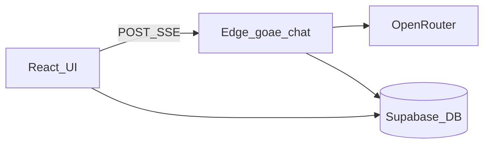

# DocBill – Architektur

Überblick über Komponenten, Datenfluss und Konfiguration. Detailierte Abläufe: [PIPELINE.md](./PIPELINE.md). API-Vertrag: [API-goae-chat.md](./API-goae-chat.md).

## Komponenten

| Schicht | Technologie | Rolle |
|--------|-------------|--------|
| Web-App | React, TypeScript, Vite, Tailwind, shadcn/ui | UI, Chat, Einstellungen, Aufruf der Edge Function |
| Backend | Supabase (Auth, Postgres, Row Level Security) | Nutzerdaten, Konversationen, Nachrichten, Hintergrundjobs |
| Serverlogik | Supabase Edge Function `goae-chat` (Deno) | Intent-Routing, Rechnungs-/Service-Pipelines, Chat ohne Upload |
| KI-Gateway | OpenRouter (Secret `OPENROUTER_API_KEY` in Supabase) | LLM-Aufrufe aus der Edge Function |

Die App lädt GOÄ-Kontext (Katalogauszüge, Paragraphen, Regeln) **in der Edge Function** ein und kombiniert das mit optionalen Admin-Dateien und Nutzer-`extra_rules`.

## Datenfluss (Happy Path)

1. Nutzer sendet Nachricht (optional mit Dateien). Das Frontend baut `messages`, `files`, `model`, `engine_type`, `extra_rules` und optional `last_invoice_result` / `last_service_result`.
2. [`executeGoaeChatRequest`](../src/lib/executeGoaeChatRequest.ts) sendet `POST` an `goae-chat` mit Supabase-`Authorization`-Header (anonym oder Session, wie im Client verwendet).
3. Die Antwort ist ein **SSE-Stream** (`text/event-stream`). Er enthält Fortschritts-Events, optional strukturierte Ergebnisse und OpenRouter-kompatible `choices[].delta.content`-Chunks für Fließtext.
4. [`consumeGoaeChatSseStream`](../src/lib/goaeChatSse.ts) parst die Events; UI aktualisiert Progress, `InvoiceResult`/`ServiceBillingResult` und Markdown-Chat.
5. Persistenz: Konversationen und Nachrichten in Supabase; strukturierte Assistentenantworten auch in `messages.structured_content` (siehe [DATA_MODEL.md](./DATA_MODEL.md)).

## Engine-Typ und Einstellungen

- **`engine_type`** steuert nur den **Rechnungs-Upload-Pfad** (wenn Dateien vorliegen und der Workflow nicht „Leistungen abrechnen“ ist):
  - `simple`: zweistufige Pipeline (Dokumentparser + ein großer LLM-Aufruf mit Streaming), **ohne** strukturiertes `pipeline_result`.
  - sonst (Standard): sechsstufige Pipeline mit Regelengine und **`pipeline_result`** vor der Erklärung.
- Werte kommen aus `user_settings.engine_type` mit Fallback auf `global_settings.default_engine` (siehe Types in [`types.ts`](../src/integrations/supabase/types.ts)).

## Admin-Kontext und Regeln

- **`extra_rules`**: Kombination aus globalen Standardregeln und nutzerspezifischen Regeln (vom Client gebildet).
- **RAG-ähnlicher Admin-Kontext**: Die Function lädt relevante Ausschnitte aus hochgeladenen Admin-Textdateien (`loadRelevantAdminContext` nach Query aus Nutzerfrage bzw. Pipeline-Zwischenstand).
- Globale/persönliche Regeln werden im Chat-Systemprompt bzw. in Pipeline-Prompts eingebunden.

## Umgebungen und URLs

| Umgebung | Chat-URL | Hinweis |
|----------|-----------|---------|
| Vite Dev (`import.meta.env.DEV`) | `/api/supabase/functions/v1/goae-chat` | Proxied auf `VITE_SUPABASE_URL` ([`vite.config.ts`](../vite.config.ts)); Dev-Server-Port standard **8080**. |
| Produktion | `${VITE_SUPABASE_URL}/functions/v1/goae-chat` | Direkt gegen Supabase. |

Relevante **Client-Env-Variablen** (Platzhalter, keine Secrets im Repo): `VITE_SUPABASE_URL`, `VITE_SUPABASE_PUBLISHABLE_KEY`, `VITE_SUPABASE_PROJECT_ID` – siehe [README.md](../README.md) und [SUPABASE_SETUP.md](../SUPABASE_SETUP.md).

Relevantes **Supabase-Secret** für die Function: `OPENROUTER_API_KEY`.

## Weiterführend

- [DATA_MODEL.md](./DATA_MODEL.md) – Tabellen und `structured_content`
- [TROUBLESHOOTING.md](./TROUBLESHOOTING.md) – Logs und typische Fehler
- [SECURITY.md](./SECURITY.md) – Datenflüsse und Verantwortungstrennung
