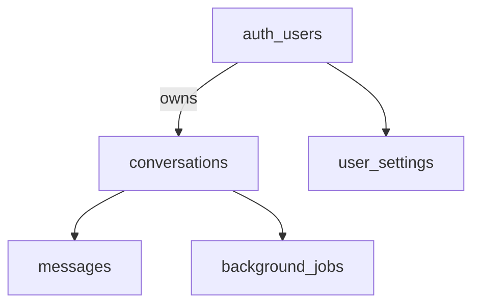

# DocBill – Datenmodell (Postgres / Supabase)

Schema-Typen im Repo: [`src/integrations/supabase/types.ts`](../src/integrations/supabase/types.ts). Migrationen: [`supabase/migrations/`](../supabase/migrations/).

## Öffentliche Tabellen (Überblick)

| Tabelle | Zweck |
|---------|--------|
| `conversations` | Chat-Session pro Nutzer: Titel, Archiv, `source_filename`, Zeitstempel. |
| `messages` | Einzelne Nachrichten (`role`, `content`, optional `structured_content`). |
| `background_jobs` | Warteschlange für lange KI-Läufe pro Konversation; Fortschritt und Fehler. |
| `user_settings` | Pro Nutzer: `engine_type`, `selected_model`, `custom_rules`, `praxis_stammdaten`. |
| `global_settings` | Singleton-artig: `default_engine`, `default_model`, `default_rules`. |
| `user_roles` | Rollen (z. B. Admin) pro `user_id`. |
| `admin_context_files` | Hochgeladene Admin-Texte für RAG (`content_text`, `filename`, `uploaded_by`). |

## Beziehungen (konzeptionell)

Foreign Keys u. a.: `messages.conversation_id` → `conversations.id`, `background_jobs.conversation_id` → `conversations.id`.

## `messages.structured_content`

- Spalte: **JSONB**, nullable.
- Zweck: strukturierte Antworten der Assistentin (z. B. Daten für Rechnungskarte oder Service-Billing), ergänzend oder zusammen mit `content` (Markdown).
- Migration: [`20260325180000_messages_structured_content.sql`](../supabase/migrations/20260325180000_messages_structured_content.sql) (inkl. zusätzlicher UPDATE-Policy für eigene Nachrichten).
- Frontend-Mapping: u. a. [`dbMessageToChatMessage.ts`](../src/lib/dbMessageToChatMessage.ts), [`messageStructuredContent.ts`](../src/lib/messageStructuredContent.ts).

## `background_jobs`

- Verknüpft `user_id` und `conversation_id`.
- Felder wie `status`, `payload` (JSON), `error`, `progress_label`, `progress_step`, `progress_total`, Zeiten `created_at` / `started_at` / `finished_at`.
- Ermöglicht Hintergrundausführung und Fortschrittsanzeige, während die SSE-Anfrage läuft bzw. danach persistiert wird (siehe [`useBackgroundJobQueue`](../src/hooks/useBackgroundJobQueue.ts)).

## Row Level Security (RLS)

- Konkrete Policies liegen in den SQL-Migrationen (nicht hier wiederholen).
- Prinzip: Nutzer sehen/schreiben typischerweise nur **eigene** Konversationen und Nachrichten; `global_settings` / Admin-Tabellen sind restriktiver.
- **Edge Functions** können mit dem **Service Role Key** arbeiten und RLS umgehen, wenn der Code das so einsetzt (z. B. für Storage/Feedback in Kommentaren bestimmter Migrationen). Die Browser-App nutzt den **Anon-/User-JWT** und unterliegt RLS.

Bei Schemaänderungen: neue Migration anlegen und `types.ts` mit Supabase CLI oder manuell abstimmen.
