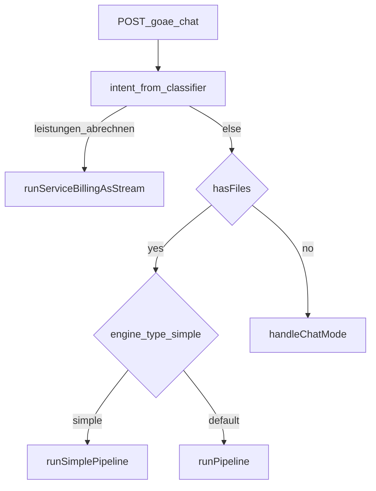

# DocBill – Pipelines und Intent-Routing

Die Edge Function [`goae-chat`](../supabase/functions/goae-chat/index.ts) entscheidet zuerst **welcher Workflow** gilt, dann **welche Pipeline** läuft. **SSE-Ereignisformate** (kanonische Liste): [API-goae-chat.md](./API-goae-chat.md).

## Intent-Workflows

Der Klassifikator ([`intent-classifier.ts`](../supabase/functions/goae-chat/intent-classifier.ts)) liefert einen von drei Intents:

| Intent | Bedeutung |
|--------|-----------|
| `rechnung_pruefen` | Bestehende Rechnung/Beleg prüfen oder korrigieren |
| `leistungen_abrechnen` | Erbrachte Leistungen beschreiben → GOÄ-Vorschläge (Service-Billing) |
| `frage` | Allgemeine GOÄ-Frage (Chat ohne strukturierte Rechnungspipeline) |

**Optimierung:** Wenn Dateien angehängt sind und die Nutzernachricht **kurz** ist bzw. kein „Leistungen abrechnen“-Muster trifft, wird der Klassifikator übersprungen und direkt `rechnung_pruefen` angenommen (schnellerer Pfad für klassisches „Rechnung hochladen“).

**Korrektur ohne Dateien:** Ist der Intent `leistungen_abrechnen`, aber es gibt **keine** Dateien, heuristisch erneut prüfen: wirkt es wie eine reine Frage → `frage`.

## Routing (Überblick)

Quellcode: Verzweigung in [`index.ts`](../supabase/functions/goae-chat/index.ts) (nach `classifyIntent` bzw. Fast-Path).

## A) Service-Billing (`leistungen_abrechnen`)

**Funktion:** [`runServiceBillingAsStream`](../supabase/functions/goae-chat/pipeline/service-billing-orchestrator.ts) ruft intern `runServiceBillingPipeline` auf und streamt Ergebnis + kurzen Einleitungstext.

**Logik (konzeptionell):**

1. Optional: Behandlungsbericht/PDF/Bild parsen (`parseBehandlungsbericht`); sonst Freitext aus der Nachricht.
2. Medizinisches NLP (`analysiereMedizinisch`).
3. Leistungen und Sachkosten aus der Analyse ableiten.
4. GOÄ-Mapping (`mappeGoae`).
5. Regelprüfung für Vorschläge (`pruefeServiceBillingVorschlaege`), Ziffern filtern, Beträge aus Katalog.
6. Ergebnis als `service_billing_result`; bei Fehler `service_billing_error`.

Fortschritts-Labels (4 Schritte): u. a. „Dokument wird analysiert…“, „Leistungen werden erkannt…“, „GOÄ-Zuordnung…“, „Vorschläge werden erstellt…“.

## B) Rechnungsprüfung mit Dateien

Abhängig von `engine_type`:

### Standard-Engine (6 Schritte)

[`runPipeline`](../supabase/functions/goae-chat/pipeline/orchestrator.ts):

1. Dokumentparser (mit Retry) – strukturierte Rechnung.
2. Medizinisches NLP.
3. Leistungsextraktion (deterministisch).
4. GOÄ-Mapping (LLM-gestützt).
5. Regelengine (`pruefeRechnung`, deterministisch).
6. Strukturiertes Ergebnis als **`pipeline_result`** (Prüfung + Stammdaten), danach **Streaming-Erklärungstext** (OpenRouter).

Zwischen den Schritten: `pipeline_progress`. Keep-Alive-Kommentare im Stream gegen Timeouts.

### Simple-Engine (2 Schritte)

[`runSimplePipeline`](../supabase/functions/goae-chat/pipeline/simple-orchestrator.ts):

1. Parallel: Dokumentparser + Admin-Kontext.
2. Ein kombinierter LLM-Aufruf mit GOÄ-Kontext, Antwort nur als **Markdown-Stream** (OpenRouter-`choices`-Deltas).

Es wird **kein** `pipeline_result` gesendet; die UI hat keine strukturierte Rechnungskarte aus dieser Pipeline.

## C) Chat ohne Dateien (`frage`)

[`handleChatMode`](../supabase/functions/goae-chat/index.ts): klassischer Chat mit Systemprompt (GOÄ-Katalogauszug, Regeln, Formatvorgaben), Admin-Kontext und Nutzer-/Assistentenverlauf. Antwort als **Streaming-Text** (keine DocBill-speziellen `type`-Events außer ggf. Parser-Fehlern aus dem allgemeinen Stream-Handling im Client).

## Kontext für Follow-ups

Der Client kann **`last_invoice_result`** (gekürzt auf `pruefung`) und **`last_service_result`** mitsenden, damit Follow-up-Fragen und Admin-RAG den letzten Stand berücksichtigen (siehe API-Dokumentation).

## Weiterführend

- [API-goae-chat.md](./API-goae-chat.md) – JSON-Body, HTTP-Fehler, SSE-`type`-Tabelle
- [ARCHITECTURE.md](./ARCHITECTURE.md) – Proxies, Settings, Gesamtarchitektur
