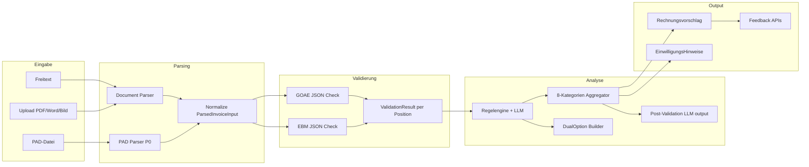

# Cycle 02 – Modi & Verarbeitungs-Pipeline

**Spec-Quelle:** `specs/02_MODES_AND_PIPELINE.md` (Abschnitte 3, 4 vollständig)  
**Referenz:** `specs/00_INDEX.md` (Tech-Stack, Cross-Refs zu `03`–`08`)  
**Status:** Plan (kein produktiver Code in diesem Schritt)  
**Cycle-Nummer (Roadmap):** `2` — Fortsetzung von `docs/plans/01_DEV_LIFECYCLE_CursorPLAN.md`  
_Hinweis zur Nummerierung:_ In der Anfrage kam „Cycle 01“ für diese Spec vor; als zweites Inkrement nach dem Lifecycle-Plan wird dieser Umsetzungszyklus hier **Cycle 02** genannt.

---

## Kontext-Analyse (Schritt 1)

### 1.1 `specs/00_INDEX.md` (Kurzfassung)

- Modulare Spec v1.3; **`02_MODES_AND_PIPELINE.md`** definiert **Modi A/B/C**, **Eingabe/Parsing/PAD**, **Pflicht-Analyse (8 Kategorien)**, **Kennzeichnung (Pills)**, **Feedback**, **IGeL**, **Einwilligungs-Hinweise**.
- Cross-Ref: Datenstrukturen aus `02` werden in `03_UI_UX`, `04_INVOICE_AND_EXPORT`, `06_ARCHITECTURE` genutzt; Wissensbasis/JSON in `05`/`06`; E2E-Mechanik in `01`.

### 1.2 Weitere Spec-Dateien (Relevanz für Cycle 02)

| Datei                      | Bezug zu Cycle 02                                                                                                                                           |
| -------------------------- | ----------------------------------------------------------------------------------------------------------------------------------------------------------- |
| `03_UI_UX.md`              | Darstellung Pills, Side-Panel, Streaming, Batch — **UI bindet an die hier definierten Typen**; Cycle 02 liefert **kanonische Domain-Typen + API-Verträge**. |
| `04_INVOICE_AND_EXPORT.md` | Rechnungsvorschlag, Export — **Euro-Pflicht**, PDF-Vermerk Einwilligung; strukturelle Anbindung an `ParsedInvoiceInput` / Analyse-Output.                   |
| `05_KNOWLEDGE_BASE.md`     | JSON lokal vs. Chunking — **Validierung gegen GOÄ-/EBM-JSON** (§4.1, §4.4).                                                                                 |
| `06_ARCHITECTURE.md`       | Pseudonymisierung, große Dateien, Sessions — **`PseudonymizedPatient`**, Speicherung, LLM-Grenzen; Post-Validierung serverseitig.                           |
| `07_COMPLIANCE_AND_OPS.md` | Disclaimer in jedem Output; Feedback-Daten **ohne PII**; Demo-Route `/dashboard/feedback?demo=true` vs. Production-Flag.                                    |
| `08_AUTH_AND_TENANCY.md`   | Feedback-Dashboard: **Admin** vs. **Manager** (nur eigene Organisation).                                                                                    |
| `01_DEV_LIFECYCLE.md`      | E2E-Fixtures, Regression, Review-Agent — **DoD und Fixtures** müssen an §2.2 anschließen.                                                                   |

### 1.3 Ist-Zustand der Codebase (Abgleich mit Spec 02)

| Thema                                              | Spec 02                                                                      | Ist-Zustand (Stand Repo)                                                                                                     | Lücke                                                                                                                                                                                                   |
| -------------------------------------------------- | ---------------------------------------------------------------------------- | ---------------------------------------------------------------------------------------------------------------------------- | ------------------------------------------------------------------------------------------------------------------------------------------------------------------------------------------------------- |
| **Modi A/B/C**                                     | Explizite `mode: 'A' \| 'B' \| 'C'` + `regelwerk`                            | Intent-Routing: `rechnung_pruefen`, `leistungen_abrechnen`, `frage` (siehe `docs/PIPELINE.md`, `src/lib/docbillUseCases.ts`) | Kein durchgängiges **`AnalyseRequest`**-Modell; **EBM** als Regelwerk nicht produktiv durchgängig.                                                                                                      |
| **Regelwerk-Auswahl**                              | Automatik zuerst, sonst Nutzerwahl GOÄ/EBM                                   | Faktisch **GOÄ-lastig** (Kataloge, Prompts, Regelengine)                                                                     | **Regelwerk-Kanal** end-to-end (Parser, Validierung, LLM-Kontext) fehlt für EBM.                                                                                                                        |
| **Eingabeformate**                                 | Tabelle Modus × Format (PDF, Word, Bild, PAD, CSV …)                         | PDF/Bild/Text über **Dokumentparser** / Engine 3 (`dokument-parser.ts`, `upload-segmentation.ts`)                            | **PAD-Parser** (P0-Formate), **Word .docx**, **CSV/Excel** gemäß Matrix größtenteils **nicht** als spezifikationskonforme `ParsedInvoiceInput`-Pipeline.                                                |
| **PAD**                                            | `PADParser`, `detectFormat`, Fehlermeldung bei unbekanntem Format            | `bulk_review` erwähnt PAD in Use-Case-Metadaten; **keine** `PADParser`-Implementierung im Scan                               | Kompletter **PAD-Subsystem**-Block.                                                                                                                                                                     |
| **ParsedLineItem / ValidationResult**              | Strikte Felder inkl. `einzelbetrag`/`gesamtbetrag` Pflicht                   | `RechnungsPosition` / `GeprueftePosition` in `pipeline/types.ts` (andere Feldnamen, GOÄ-Fokus)                               | **Schema-Vereinheitlichung** oder Adapter-Schicht zu Spec-Typen.                                                                                                                                        |
| **8 Analyse-Kategorien**                           | Obligatorisch, Reihenfolge fix, kein Skip                                    | Regelengine (`Pruefung`-Typen) + Prompt-Texte in Migrationen (z. B. „Pflicht-Analysestruktur“)                               | **Keine** garantierte **`KategorieErgebnis[]` mit Länge 8** im API-Contract; Kategorie 6–8 (Optimierung, Dokumentation, Kombinationspflicht) **nicht** einheitlich als strukturierte Ausgabe erzwungen. |
| **DualOption**                                     | confidence &lt; 0.7 oder mehrere plausible Ziffern                           | `GoaeZuordnung.alternativZiffern`, `konfidenz` diskret                                                                       | **Kein** `DualOption`-Objekt mit Pflicht-`euroBetrag` für beide Äste.                                                                                                                                   |
| **Post-Validierung LLM → JSON**                    | Alle generierten Ziffern gegen lokale Basis                                  | Teilweise Katalog-Checks in Pipelines                                                                                        | **Expliziter** Post-Step + „nicht validierbar“-Kennzeichnung fehlt als **durchgängige** Regel.                                                                                                          |
| **Pills / Kennzeichnung**                          | 6 Stufen, feste Hex-Farben, klickbar                                         | UI-Logik in `InvoiceResult.tsx` etc.; nicht verifiziert ob 1:1 Spec-Farben/Labels                                            | **Design-Tokens + Mapping** `Kennzeichnung` → Pill.                                                                                                                                                     |
| **Alternativvorschläge / Dokumentationsbeispiele** | Typen + Modus B / Kat. 6                                                     | Engine-3 / Service-Billing liefern teils Text/JSON                                                                           | **Strukturierte** `AlternativVorschlag[]` (max. 3) und `DokumentationsBeispiel[]` fehlen als Contract.                                                                                                  |
| **Rechnungsvorschlag**                             | Euro pro Position + Summe                                                    | Vorhanden in verschiedenen SSE-Events (`pipeline_result`, `engine3_result`, …)                                               | **Einheitliches** „Rechnungsvorschlag“-Objekt gemäß `04` + Spec 02 §4.6.                                                                                                                                |
| **IGeL**                                           | Kennzeichnung, Aufklärung, Dual-GKV/GOÄ-Hinweis                              | Nicht als dedizierte Pipeline-Stufe ersichtlich                                                                              | **IGeL-Regeln** in Validierung + UI-Hinweise.                                                                                                                                                           |
| **Feedback**                                       | Daumen + Vorschlag accept/reject/modified, Aggregation, Dashboard, Demo-Flag | Edge Function `feedback` mit `rating` ±1, `message_id`, `metadata.decisions` rudimentär                                      | **VorschlagFeedback**-Schema, **responseId/vorschlagId**, Fachgebiet, **Admin-Queue**, **Aggregations-Jobs**, `/dashboard/feedback`, PostHog **demo**-Flag.                                             |
| **Einwilligung**                                   | Inline-Hinweis, Export-PDF-Vermerk                                           | Nicht als `EinwilligungsHinweis[]` im Contract                                                                               | **Positionsgebundene Hinweise** + Export-Pipeline in `04` verknüpfen.                                                                                                                                   |

**Fazit:** Die bestehende **GOÄ-zentrierte** Pipeline (goae-chat, Engine 3, Service Billing) ist eine starke Basis, erfüllt Spec 02 aber **nicht** als normativen End-to-End-Vertrag (EBM, PAD, 8 fixe Kategorien, DualOption, Feedback-Dashboard, IGeL, Einwilligung).

---

## Mapping: vollständige Abdeckung Spec 02

| Spec-Abschnitt                                                                                                | In diesem Plan                                                                                      |
| ------------------------------------------------------------------------------------------------------------- | --------------------------------------------------------------------------------------------------- |
| **§3** Modi A/B/C                                                                                             | [Scope](#scope), [Architecture](#architecture), [Tech Stack](#tech-stack--patterns)                 |
| **§3.1** Regelwerk, `AnalyseRequest`                                                                          | [Scope](#scope), [Decisions](#decisions-required), [File Changes](#file-changes)                    |
| **§4.1** Eingabeformate, PAD-Tabelle, `PADParser`, `ParsedInvoiceInput`, `ParsedLineItem`, `ValidationResult` | [Scope](#scope), [Architecture](#architecture), [File Changes](#file-changes), [E2E](#e2e-fixtures) |
| **§4.2** 8 Kategorien, `KombinationspflichtCheck`, `KategorieErgebnis`, `PruefItem`                           | [Scope](#scope), [Architecture](#architecture), [DoD](#definition-of-done-dod)                      |
| **§4.3** `DualOption`                                                                                         | [Scope](#scope), [Architecture](#architecture)                                                      |
| **§4.4** Post-Validierung (5 Punkte)                                                                          | [Scope](#scope), [DoD](#definition-of-done-dod)                                                     |
| **§4.5** Kennzeichnungssystem / Pills                                                                         | [Scope](#scope), [File Changes](#file-changes), Cross-`03`                                          |
| **§4.5.1** `AlternativVorschlag`, `DokumentationsBeispiel`                                                    | [Scope](#scope), [Architecture](#architecture)                                                      |
| **§4.6** Rechnungsvorschlag                                                                                   | [Scope](#scope), Dependencies → `04`                                                                |
| **§4.7** IGeL                                                                                                 | [Scope](#scope), [Decisions](#decisions-required)                                                   |
| **§4.8** Feedback (beide Kanäle, Loop, Review-Queue, Dashboard, Demo)                                         | [Scope](#scope), [Architecture](#architecture), [File Changes](#file-changes)                       |
| **§4.9** `EinwilligungsHinweis`                                                                               | [Scope](#scope), Dependencies → `04` Export                                                         |

---

## Scope

Cycle 02 liefert ein **lauffähiges, testbares Inkrement**: Nutzer können mindestens **einen** der Modi A/B/C mit klarer **Regelwerk-Wahl (GOÄ oder EBM)** anstoßen; die **Serverantwort** enthält eine **verbindliche Analysestruktur mit genau 8 Kategorien** (jede mit `KategorieErgebnis`), **Euro-Beträge** dort wo die Spec Pflicht vorschreibt, **Kennzeichnungen** für Items, und — soweit im Cycle umsetzbar — **Grundlagen** für Feedback und Einwilligungs-Hinweise.

### Mindestlieferumfang (empfohlene Aufteilung innerhalb von ≤ 3 Wochen)

1. **Domain- und API-Vertrag (Spec-typkonform)**
   - Zentrale TypeScript-Definitionen für alle in Spec 02 genannten Interfaces (inkl. `AnalyseRequest`, `ParsedInvoiceInput`, `ParsedLineItem`, `ValidationResult`, `KategorieErgebnis`, `PruefItem`, `KombinationspflichtCheck`, `DualOption`, `AlternativVorschlag`, `DokumentationsBeispiel`, `DaumenFeedback`, `VorschlagFeedback`, `EinwilligungsHinweis`).
   - **`Kennzeichnung`** als enum/union mit Zuordnung zu Pill-Labels und CSS-Klassen (Hex laut Spec).

2. **Modus- und Regelwerk-Schicht**
   - Explizite Abbildung **Modus A/B/C** ↔ bestehende Intents/Pipelines **ohne** doppelte Wahrheit: ein **Orchestrator** entscheidet anhand `mode` + `regelwerk` welche Parser-, Validierungs- und LLM-Pfade laufen.
   - **Automatische Regelwerk-Erkennung** wo möglich (z. B. PAD-Heuristik GKV→EBM, PKV→GOÄ — sobald PAD vorhanden); sonst **UI + API** für Nutzerwahl.

3. **Parsing & Validierung (Inkrement P0)**
   - **GOÄ-Pfad:** Bestehende Rechnungspositionen → normalisieren auf `ParsedLineItem` + `ValidationResult` über **lokales GOÄ-JSON** (bereits im Repo).
   - **EBM-Pfad (Minimal):** Einbindung **EBM-JSON** (Version aus Health/Config) für Existenz/Punktzahl/Basisvalidierung — Umfang in [Decisions](#decisions-required) festlegen, aber **kein** „halbes EBM“ ohne Datenbasis.
   - **PAD P0:** `PAD_STANDARD`, `TURBOMED`, `CGM_M1` — `detectFormat`, parse, Fehlertext bei unbekanntem Format exakt laut Spec.

4. **Analyse-Orchestrierung (8 Kategorien)**
   - **Deterministischer „Aggregator“** nach LLM/Regelengine: erzeugt immer **8** `KategorieErgebnis`-Einträge (auch wenn „keine Befunde“ → `status: ok` mit leeren `items`).
   - Regelengine- und LLM-Outputs werden **gemappt** auf Kategorien 1–8 (kein stiller Skip).

5. **DualOption & Post-Validierung**
   - Wenn Konfidenz &lt; 0.7 oder Konflikt: **`DualOption`** im API-JSON (Frontend kann in Cycle 03/`03` voll visualisieren; Cycle 02 liefert Daten).
   - Post-Validierung: implementierte **5-Punkte-Checkliste** gegen JSON-Basis; Verletzungen → Kennzeichnung **PRÜFEN**/**FEHLER** + „nicht validierbar“.

6. **Rechnungsvorschlag (§4.6)**
   - Ein **kanonisches** aggregiertes Objekt (Positionen + Summen in Euro) aus Analyse, kompatibel mit `04_INVOICE_AND_EXPORT.md` (Verweis, keine vollständige Export-Implementierung nötig wenn Cycle getrennt).

7. **IGeL (§4.7)**
   - Regelbasierte **Kennzeichnung** + **Hinweistexte** (Aufklärung/Vereinbarung); Hinweis bei **GKV/IGeL-Dualität** wenn Datenlage es erlaubt.

8. **Feedback (§4.8) — Foundation**
   - API + DB (oder erweiterte Nutzung bestehender Tabellen) für **`DaumenFeedback`** und **`VorschlagFeedback`**.
   - **Serverseitige Aggregation** (z. B. materialisierte Sicht oder Cron/Edge-Job): Annahme-/Ablehnungsraten pro Ziffer+Fachgebiet; Flag bei Ablehnung &gt; 30 %; Anhebung Confidence bei &gt; 90 % **als Konfigurations-Hook** (kein ML-Fine-Tuning).
   - Route **`/dashboard/feedback`** mit Rollen aus `08` (Minimal: geschützte Seite + leere States); **`?demo=true`** + PostHog Feature-Flag laut Spec.

9. **Einwilligung (§4.9)**
   - Strukturierte **`EinwilligungsHinweis[]`** an Positionen; Inline-Darstellung kann in `03` vertieft werden; **Export-Vermerk** gekoppelt an `04` (Planung: Contract in Cycle 02, PDF-Druck in späterem Teil-Cycle wenn nötig).

**Explizit außerhalb oder nur vorbereitend (wenn Scope platzt):** Vollständige **Word**-Pipeline, alle **P1/P2-PAD-Formate**, vollständiges **Feedback-Dashboard-Design**, **Clustering** von Freitext-Ablehnungsgründen ( kann als Phase 2 mit einfacher Keyword-Liste starten).

---

## Decisions Required

1. **EBM-Datenbasis:** Liegt **EBM-JSON** (gleiche Rolle wie `goae-catalog-*.json`) bereit — Pfad, Update-Prozess, Lizenz? Ohne klare Quelle: Scope auf **GOÄ + Contract für EBM** (Stub-Validierung) begrenzen?

2. **Runtime für PAD/Office-Parsing:** Deno Edge vs. **separater Worker** (Node) wegen nativer Libraries (xlsx, mammoth, csv-parse)? Performance- und DSGVO-Abgrenzung mit `06` abstimmen.

3. **Pseudonymisierung:** Definition von `PseudonymizedPatient` und Speicherung (nur Hash? Geburtsjahr? Geschlecht?) — verbindlich mit `06`/`07`.

4. **Single Source of Truth für Modi:** Beibehaltung der Intent-Namen intern + **`mode` im API** nach außen — oder vollständige Migration zu `mode`/`regelwerk` in allen Clients?

5. **Konfidenz-Schwellwert:** Exakt **0.7** oder konfigurierbar pro Organisation?

6. **Feedback-Speicher:** Neue Tabellen vs. Erweiterung bestehender `feedback`-Speicherung; **Anonymisierungsregeln** vor Speicherung von Freitext.

7. **IGeL-Erkennung:** Nur über **Ziffern-Metadaten** im GOÄ-JSON oder zusätzlicher **KB/Regel**-Layer?

8. **Rechnungsvorschlag vs. Legacy-Events:** Breaking Change für SSE (`pipeline_result` etc.) oder **Versionierung** (`analyse_v2`)?

---

## Architecture

### Zielbild (logisch)



### Änderungen am bestehenden System

- **Neue Schicht** `analyse-contract` (shared package oder `src/lib/analyse/` + Import in Edge Functions via Duplicate oder **npm workspace** — Decision): verhindert Drift zwischen UI und Backend.
- **Orchestrator-Erweiterung** in `goae-chat/index.ts` (oder neues `analyse-orchestrator.ts`): zuerst **`mode`/`regelwerk` auflösen**, dann bestehende `runPipeline` / `runEngine3AsStream` / `handleChatMode` als **Unterpfade** aufrufen, Ergebnis **in Spec-JSON normalisieren**.
- **Aggregator-Modul:** mappt `Pruefung[]`, LLM-JSON und Katalogdaten auf **`KategorieErgebnis[8]`**.
- **PAD:** eigenes Modul, strikt getestet mit **Golden Files** (anonymisierte Samples).
- **Feedback:** Ergänzung zu `supabase/functions/feedback` oder zweite Function `feedback-v2`; Dashboard liest nur **aggregierte** + **bereinigte** Daten.

### Datenfluss (Kurz)

1. Client sendet `AnalyseRequest` (+ Dateien).
2. Server: Parse → `ParsedInvoiceInput` → `ValidationResult[]`.
3. Kernlogik (bestehend + erweitert) → Rohergebnis.
4. **Aggregator** → `analyse: { kategorien: KategorieErgebnis[8], dualOptions: DualOption[], rechnungsvorschlag, einwilligungsHinweise, dokumentationsBeispiele, alternativVorschlaege }`.
5. Client rendert (mit `03`); Feedback-Events an Server.

---

## File Changes

### Neu (beispielhaft, Pfade an tatsächliche Monorepo-Struktur anpassen)

| Pfad                                                                       | Zweck                                                           |
| -------------------------------------------------------------------------- | --------------------------------------------------------------- |
| `src/lib/analyse/types.ts` (oder `packages/analyse-contract/src/index.ts`) | Alle Spec-02-Interfaces + `Kennzeichnung`-Mapping               |
| `src/lib/analyse/kategorien.ts`                                            | Konstanten Titel/Reihenfolge Kategorien 1–8                     |
| `src/lib/analyse/aggregateKategorien.ts`                                   | 8-Kategorien-Aggregator                                         |
| `src/lib/analyse/pillStyles.ts`                                            | Farben #22C55E, #3B82F6, … → Tailwind/CSS                       |
| `supabase/functions/_shared/pad/` oder `supabase/functions/pad-parser/`    | `PADParser`, Detector, P0-Implementierungen                     |
| `supabase/functions/_shared/pad/fixtures/`                                 | Golden-File-Tests (keine echten Patientendaten)                 |
| `supabase/migrations/*_feedback_vorschlag.sql`                             | Tabellen/RLS für `VorschlagFeedback`, Aggregation, Review-Queue |
| `src/pages/FeedbackDashboard.tsx` (oder Route unter bestehendem Router)    | `/dashboard/feedback`                                           |
| `e2e-runner/fixtures/MODE_*.yaml`                                          | Blackbox-Fixtures (siehe unten)                                 |

### Bestehende Dateien (erwartete Änderungen)

| Pfad                                                                                | Änderung                                                                          |
| ----------------------------------------------------------------------------------- | --------------------------------------------------------------------------------- |
| `supabase/functions/goae-chat/index.ts`                                             | `AnalyseRequest` einlesen; Orchestrierung mode/regelwerk; Response-Normalisierung |
| `supabase/functions/goae-chat/pipeline/types.ts`                                    | Adapter-Typen zu `ParsedLineItem` / Deprecation-Plan                              |
| `supabase/functions/goae-chat/pipeline/regelengine.ts`                              | Zusätzliche Regeln IGeL, Kombinationspflicht wo Daten verfügbar                   |
| `supabase/functions/goae-chat/pipeline/orchestrator.ts` / `engine3/orchestrator.ts` | Rückgabe an Aggregator                                                            |
| `supabase/functions/feedback/index.ts`                                              | Payload `VorschlagFeedback`, IDs, Fachgebiet                                      |
| `src/components/InvoiceResult.tsx` (und verwandt)                                   | Kennzeichnung-Pills laut Spec; DualOption / Alternativen (teilweise)              |
| `src/lib/docbillUseCases.ts`                                                        | Mapping mode ↔ Intents dokumentieren                                              |
| `docs/API-goae-chat.md`                                                             | Neuer JSON-Contract, Versionierung                                                |
| `src/messages/de.ts`                                                                | i18n PAD-Fehler, Einwilligungs-Hinweis                                            |

---

## Dependencies

- **Vorher / parallel:** Cycle 01 (CI, E2E-Runner, Health) lauffähig; Regression der bestehenden Fixtures.
- **Extern:** EBM-JSON-Quelle und Import-Skript; ggf. **OpenRouter** für LLM (bereits vorhanden).
- **Specs:** Abstimmung mit **`04_INVOICE_AND_EXPORT`** für Rechnungsvorschlag-Shape und PDF-Vermerk; **`08`** für Dashboard-Rollen; **`06`** für Pseudonymisierung.
- **Daten:** Anonymisierte PAD-**Samples** je P0-Format für Tests (rechtliche Freigabe).

---

## Tech Stack & Patterns

| Bereich                         | Wahl                                                                            |
| ------------------------------- | ------------------------------------------------------------------------------- |
| **Sprache**                     | TypeScript (Frontend + Deno Edge Functions)                                     |
| **Validierung**                 | Zod oder ähnlich für Runtime-Validation des LLM-JSON (empfohlen)                |
| **PAD**                         | Zeilenbasierte Parser + Signaturen für `detectFormat`; keine „Magic“ ohne Tests |
| **8 Kategorien**                | **Template-Method** / feste Pipeline: `buildKategorie(n, context)`              |
| **DualOption**                  | **Strategy** aus Konfidenz-Metriken und Alternativliste                         |
| **Feedback-Aggregation**        | DB-Views + scheduled Edge Function oder Postgres `pg_cron` (falls verfügbar)    |
| **Feature-Flag Demo-Dashboard** | PostHog (bereits in Spec `00`)                                                  |
| **DB**                          | PostgreSQL (Supabase); RLS für Mandanten                                        |
| **Tests**                       | Vitest für Pure-Logik; PAD Golden Files; E2E über `e2e-runner`                  |

**DB-Schema (Skizze, in Migration zu verfeinern):**

- `feedback_thumb` (`response_id`, `user_id`, `type`, `comment`, `created_at`, tenant)
- `feedback_vorschlag` (`vorschlag_id`, `response_id`, `aktion`, `modified_to`, `fachgebiet`, …)
- `feedback_agg_ziffer` (`ziffer`, `fachgebiet`, `accepted`, `rejected`, `modified`, `rate`, `flag_review`)

---

## E2E-Fixtures

Format analog `specs/01_DEV_LIFECYCLE.md` §2.2 (YAML). **Regression:** nach Cycle 02 laufen alle bisherigen Fixtures (z. B. `HEALTH_001`, …) **plus** die neuen.

### `MODE_C_001` — Modus C, GOÄ-Frage, strukturierte Antwort

```yaml
fixture_id: "MODE_C_001"
name: "Fragestellung GOÄ mit Pflicht-Disclaimer und Quelle"
input:
  type: "api_post"
  path: "/functions/v1/goae-chat"
  body:
    mode: "C"
    regelwerk: "GOAE"
    message: "Ab welchem Faktor ist bei Ziffer 1240 eine Begründung erforderlich?"
expected:
  analyse:
    kategorien_count: 8
  output:
    contains_disclaimer: true
    response_time_max_ms: 120000
  no_pii_in_llm_request: true
```

### `MODE_A_PAD_001` — Modus A, PAD P0, Parsing + Validierung

```yaml
fixture_id: "MODE_A_PAD_001"
name: "PAD_STANDARD Export wird erkannt und zu Positionen normalisiert"
input:
  type: "api_post_multipart"
  path: "/functions/v1/goae-chat"
  file: "fixtures/pad/pad_standard_sample.anon.bin"
  body:
    mode: "A"
    regelwerk: "EBM"
expected:
  parsing:
    inputType: "pad"
    detected_pad_format: "PAD_STANDARD"
    positionen_min: 1
  validation:
    alle_positionen_haben_einzelbetrag: true
  analyse:
    kategorien_count: 8
  output:
    contains_disclaimer: true
  no_pii_in_llm_request: true
```

### `MODE_B_DUAL_001` — Modus B, DualOption bei niedriger Konfidenz

```yaml
fixture_id: "MODE_B_DUAL_001"
name: "Fallbeschreibung liefert DualOption wenn Konfidenz unter Schwelle"
input:
  type: "api_post"
  path: "/functions/v1/goae-chat"
  body:
    mode: "B"
    regelwerk: "GOAE"
    message: "[kontrollierter Testfall mit zwei gleich plausiblen Ziffern – Inhalt aus Benchmark-Set]"
expected:
  analyse:
    kategorien_count: 8
    dual_option_present: true
  output:
    euro_betraege_in_dual_option: true
    contains_disclaimer: true
  no_pii_in_llm_request: true
```

### `FEEDBACK_001` — Daumen + Vorschlag speichern

```yaml
fixture_id: "FEEDBACK_001"
name: "VorschlagFeedback accepted wird persistiert und in Aggregation sichtbar"
input:
  type: "api_sequence"
  steps:
    - post_analyse_for_vorschlag_id
    - post_feedback_vorschlag:
        aktion: "accepted"
expected:
  output:
    feedback_row_exists: true
  no_pii_in_llm_request: true
```

### `IGEL_001` — IGeL-Kennzeichnung

```yaml
fixture_id: "IGEL_001"
name: "IGeL-fähige Ziffer erzeugt Hinweis und Kennzeichnung"
input:
  type: "api_post"
  path: "/functions/v1/goae-chat"
  body:
    mode: "A"
    regelwerk: "GOAE"
    message: "Rechnung mit IGeL-Ziffer [Testfall]"
expected:
  analyse:
    kategorien_count: 8
    igel_hinweis_min: 1
  output:
    contains_disclaimer: true
```

_Hinweis:_ Konkrete Pfade (`api_post_multipart`) und Auth-Header sind an den **E2E-Runner** und die **tatsächliche API** anzupassen (siehe `e2e-runner/src/`).

---

## Definition of Done (DoD)

1. **Spec-Treue:** Alle in der Sektion „Mapping: vollständige Abdeckung Spec 02“ genannten Abschnitte sind **implementiert oder bewusst** in einem nachvollziehbaren **Follow-up-Cycle** dokumentiert (keine stillen Auslassungen).
2. **API:** `AnalyseRequest` mit `mode` + `regelwerk` wird akzeptiert; Antwort enthält **`kategorien.length === 8`** in fester Reihenfolge (1–8).
3. **Euro-Pflicht:** Jeder `PruefItem`-Vorschlag mit finanziellem Impact hat `euroBetrag`; `DualOption.primaer/alternativ.euroBetrag` gesetzt; `ValidationResult.berechneterBetrag` gesetzt.
4. **PAD P0:** `detectFormat` + Parse für mindestens **PAD_STANDARD, TURBOMED, CGM_M1**; unbekanntes Format → **exakter** Nutzertext laut Spec §4.1.
5. **Post-Validierung:** Alle LLM-Ziffern werden gegen die **lokale** JSON-Basis geprüft; nicht existent → **„nicht validierbar“** sichtbar in Datenmodell + UI-Hook.
6. **Kennzeichnung:** Pills entsprechen **Labels und Farben** aus Spec §4.5 (keine Emojis in Pills).
7. **Feedback:** Speicherung **Daumen** + **Vorschlag**; Aggregation erkennt **&gt; 30 % Ablehnung** → Review-Flag in DB; **`/dashboard/feedback`** erreichbar mit Rollenmodell (auch wenn UI noch minimal); **`?demo=true`** + Feature-Flag-Verhalten spezifiziert und getestet.
8. **Einwilligung:** `EinwilligungsHinweis[]` wird erzeugt, wenn Regeln auslösen; Kopplung an Export in `04` dokumentiert oder im gleichen Cycle umgesetzt.
9. **E2E:** Alle Fixtures in [E2E-Fixtures](#e2e-fixtures) **grün** + **Regression** aller vorherigen Cycle-Fixtures.
10. **Review-Agent / Lint / Types:** Projektregeln aus `01` eingehalten; keine hartcodierten Ziffern außerhalb der Datenbasis (Review-Agent-Regel).
11. **Disclaimer:** Jede Antwort enthält den **Pflicht-Disclaimer** (`00_INDEX` / `07`).

---

**READY FOR INPUT** 🔔

_(Hinweis: Ein „Sound“ kann in deiner Umgebung nicht abgespielt werden; bitte bei Bedarf eine Benachrichtigung am Gerät auslösen.)_
